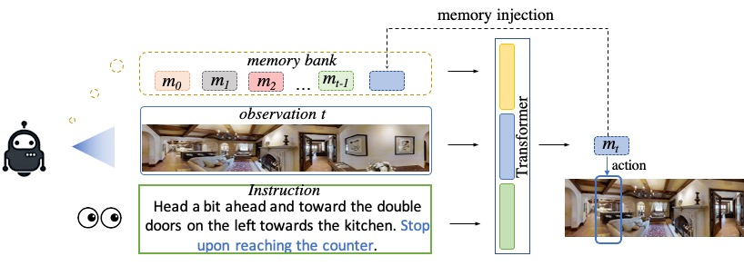
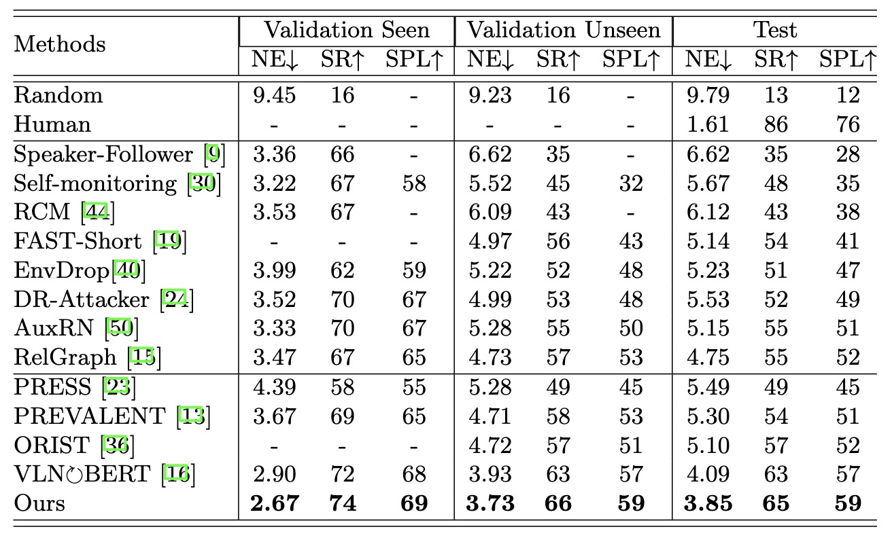

# Multimodal Transformer with Variable-length Memory for Vision-and-Language Navigation

<p align="center">  </p>

PyTorch Code of the ECCV 2022 paper:
> [**Multimodal Transformer with Variable-length Memory for Vision-and-Language Navigation**](https://arxiv.org/abs/2111.05759),               
> Chuang Lin, Yi Jiang, Jianfei Cai, Lizhen Qu, Gholamreza Haffari, Zehuan Yuan 

### Introduction

- Vision-and-Language Navigation (VLN) is a task that an agent is required to follow a language instruction to navigate to the goal position, which relies on the ongoing interactions with the environment during moving. 

- Our work explicitly models the history interactions between observations and the instruction which is critical for figuring out the progress of
the navigation trajectory.

- Our model MTVM achevies new state-of-the-art on R2R datasets, resulting 65\% Success Rate and 59\% SPL on unseen test set.

### Results

<p align="center">  </p>

### Requirements
- Linux or macOS with Python ≥ 3.6
- PyTorch ≥ 1.6.
```
pip install -r requirements.txt
sudo apt-get install libjsoncpp-dev libepoxy-dev libglm-dev libosmesa6 libosmesa6-dev libglew-dev
```

## Installation
Build the Simulator with following instruction. The simulater is version v0.1 of [**Matterport3D Simulator.**](https://github.com/peteanderson80/Matterport3DSimulator).
```
mkdir build && cd build
cmake -DOSMESA_RENDERING=ON ..
make
```

### Prepare datasets
Please follow the data preparation as [Recurrent VLN-BERT](https://github.com/YicongHong/Recurrent-VLN-BERT#data-preparation)


## R2R Navigation benchmark evaluation and training


The MTVM models are initialized from [PREVALENT](https://drive.google.com/drive/folders/1sW2xVaSaciZiQ7ViKzm_KbrLD_XvOq5y) (indicated by --vlnbert in the train_agent.bash file). Please download the pretrain model and place them under Prevalent/pretrained_model/ before training the MTVM models.

To train a model, run

```
bash run/train_agent.bash
``` 

To evaluate a model with a trained/ pretrained model, run 

```
bash run/test_agent.bash
``` 

Download the trained network weights [here](https://drive.google.com/drive/u/0/folders/1P1t8O0LcFtJvZORv3E2zHmdsK3Rk8HXc).

## Citation
If you find this project useful for your research, please use the following BibTeX entry.
```bibtex
@article{lin2021multimodal,
  title={Multimodal Transformer with Variable-length Memory for Vision-and-Language Navigation},
  author={Lin, Chuang and Jiang, Yi and Cai, Jianfei and Qu, Lizhen and Haffari, Gholamreza and Yuan, Zehuan},
  journal={arXiv preprint arXiv:2111.05759},
  year={2021}
}
```
## Acknowledgments
This repo is based on [Recurrent VLN-BERT](https://github.com/YicongHong/Recurrent-VLN-BERT). Thanks for their wonderful works.
